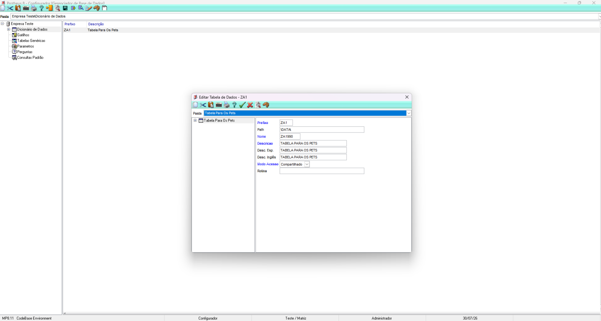
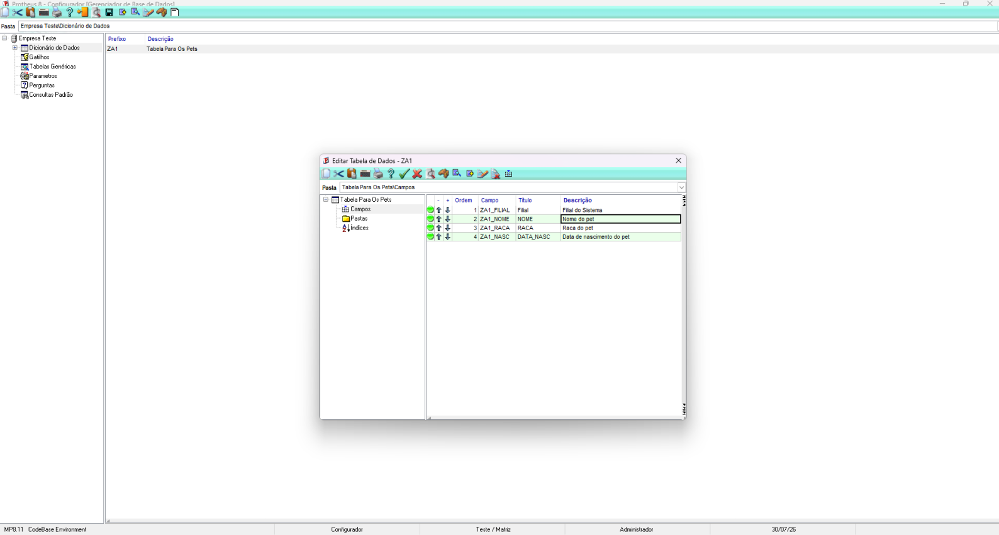
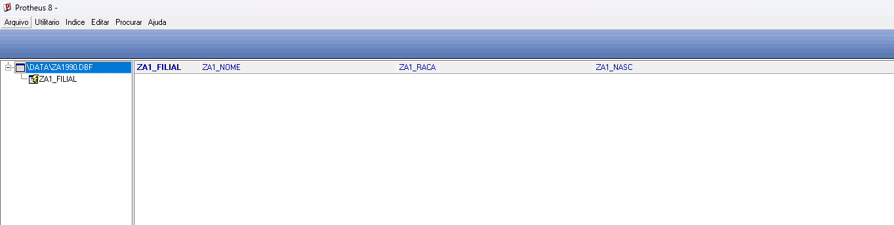

# Exercício 03 – Recriando a ZA1 no Configurador

## Objetivo

Criar a tabela **ZA1 (Cadastro de Pets)** no Configurador do Protheus, cadastrar seus campos e validar sua criação utilizando o **MPSDU**.

---

# 1. Criação da tabela ZA1 (SX2)

No módulo **Configurador (SIGACFG)**, foi realizado o cadastro da tabela ZA1 seguindo o caminho apresentado em aula:

> Base de Dados → Dicionário → Bases de Dados → Empresa Teste → Dicionário de Dados → Incluir

Foram preenchidos os seguintes dados:

| Campo | Valor |
|--------|-------|
| Prefixo | ZA1 |
| Path | \DATA\ |
| Nome | ZA1990 |
| Descrição | Tabela para os Pets |
| Modo de Acesso | Compartilhado |

Após confirmar a inclusão, a tabela passou a fazer parte do Dicionário de Dados do Protheus.

### Print da criação da tabela

---

# 2. Cadastro dos campos (SX3)

Após criar a tabela, foi realizado o cadastro dos campos que irão compor a estrutura da ZA1.

| Campo | Tipo | Tamanho | Descrição |
|--------|------|---------:|-----------|
| ZA1_FILIAL | C | 2 | Filial do sistema |
| ZA1_NOME | C | 50 | Nome do pet |
| ZA1_RACA | C | 50 | Raça do pet |
| ZA1_NASC | D | 8 | Data de nascimento |

### Print da estrutura de campos

---

# 3. Conferência no MPSDU

Após concluir o cadastro da tabela e dos campos, foi realizada a conferência utilizando o **MPSDU**, verificando se a estrutura física da tabela havia sido criada corretamente.

Durante a conferência foi possível visualizar a tabela ZA1 contendo os seguintes campos:

- ZA1_FILIAL
- ZA1_NOME
- ZA1_RACA
- ZA1_NASC

### Print da conferência no MPSDU

---

# Conclusão

A tabela **ZA1** foi criada com sucesso no Configurador do Protheus seguindo os procedimentos apresentados em aula.

Após o cadastro da tabela e de seus respectivos campos, foi realizada a conferência no **MPSDU**, confirmando que a estrutura foi criada corretamente e que os campos estavam disponíveis para utilização.
