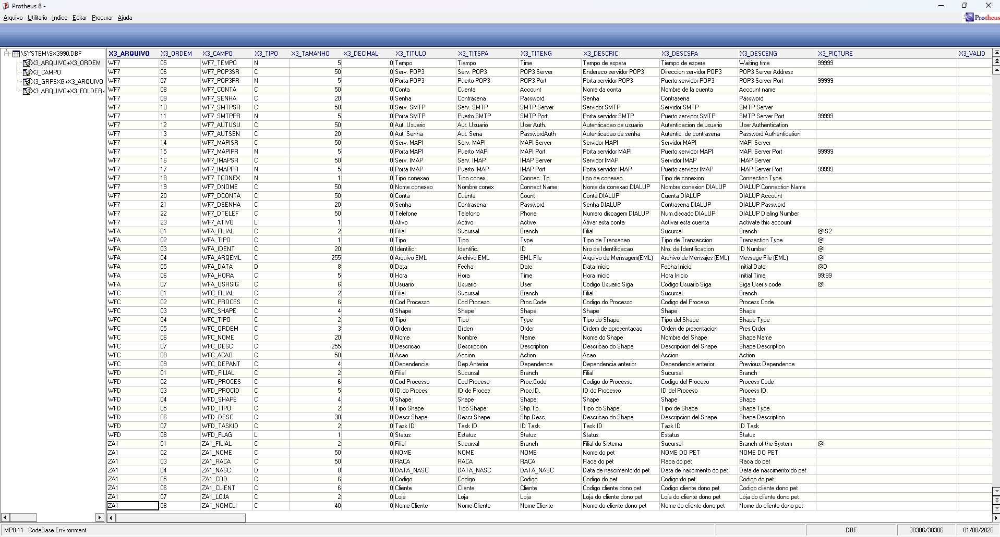
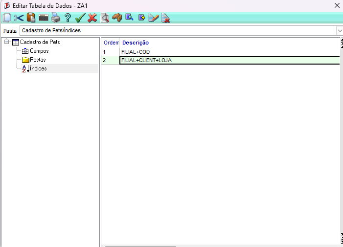
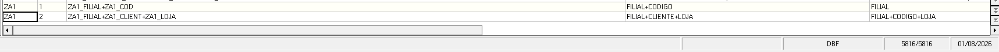

# Exercício 02 – Completando a tabela ZA1 (Pets do Cliente)

## Objetivo

Completar a tabela **ZA1 (Cadastro de Pets)** criada anteriormente, adicionando os novos campos necessários para relacionar cada pet ao seu proprietário (cliente), conforme apresentado na apostila do Módulo 08.

Também foi realizada a criação dos índices da tabela para permitir consultas por código do pet e por cliente.

---

## Desenvolvimento

### 1. Atualização da estrutura da tabela ZA1

Foi acessado o Configurador do Protheus através do caminho:

Base de Dados → Dicionário → Bases de Dados → Empresa Teste → Dicionário de Dados

Na tabela **ZA1** foram adicionados os seguintes campos:

| Campo | Tipo | Tamanho | Contexto |
|--------|------|----------|----------|
| ZA1_COD | Caracter | 6 | Real |
| ZA1_CLIENT | Caracter | 6 | Real |
| ZA1_LOJA | Caracter | 2 | Real |
| ZA1_NOMCLI | Caracter | 40 | Virtual |

Os campos existentes permaneceram na tabela:

- ZA1_FILIAL
- ZA1_NOME
- ZA1_RACA
- ZA1_NASC

O campo **ZA1_NOMCLI** foi configurado como **Virtual**, conforme solicitado no exercício.

---

### 2. Configuração dos índices (SIX)

Após a criação dos campos, foram cadastrados os índices da tabela:

**Índice 1**

```
ZA1_FILIAL + ZA1_COD
```

Descrição:

```
Filial+Código
```

---

**Índice 2**

```
ZA1_FILIAL + ZA1_CLIENT + ZA1_LOJA
```

Descrição:

```
Filial+Cliente+Loja
```

---

### 3. Validação

Após salvar a estrutura da tabela e os índices, foi realizada a conferência no ambiente Protheus, confirmando:

- criação dos novos campos;
- atualização da estrutura da ZA1;
- criação dos dois índices solicitados.

---

## Evidências

### Estrutura da tabela (SX3)



---

### Índices da tabela (SIX)



---

### Conferência dos índices



---

## Conclusão

A tabela **ZA1** foi atualizada com sucesso, recebendo os novos campos necessários para relacionar cada pet ao seu respectivo cliente.

Também foram criados os dois índices solicitados na atividade, permitindo consultas por código do pet e por cliente.

A estrutura foi validada no Configurador e conferida nas evidências apresentadas.