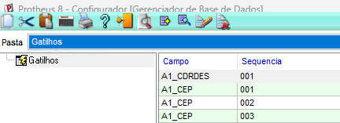
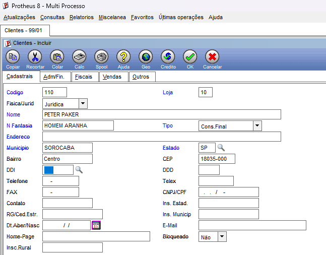

# Exercício 07 – Gatilho de CEP (SX7)

## Objetivo

Configurar gatilhos (SX7) para que, ao informar um CEP no cadastro de Clientes (SA1), o sistema preencha automaticamente os campos de Bairro, Município e Estado utilizando a função `U_STCEP`.

---

## Evidências

### 1. Gatilhos criados no SX7

---

### 2. Teste no cadastro de Clientes

---

## Respostas

### a) Qual a diferença entre campo, contra-domínio e regra em um gatilho?

- **Campo:** é o campo que dispara o gatilho quando seu valor é alterado.
- **Contra-domínio:** é o campo que receberá o valor retornado pela regra.
- **Regra:** é a expressão ou função executada para calcular o valor que será atribuído ao contra-domínio.

---

### b) Por que a regra usa `M->A1_CEP` e não `SA1->A1_CEP`?

Porque `M->A1_CEP` acessa o valor que está sendo digitado na memória durante a edição do registro. Já `SA1->A1_CEP` acessaria apenas o valor gravado na tabela, que ainda não foi atualizado naquele momento.

---

### c) Os CEPs estão dentro do fonte. Cite dois problemas disso em produção e como você resolveria.

**Problemas:**

- Sempre que um CEP for alterado ou incluído será necessário recompilar o programa.
- A manutenção dos dados fica mais difícil e menos flexível.

**Como resolver:**

Armazenar os CEPs em uma tabela do banco de dados ou utilizar um serviço externo (API de CEP), permitindo atualização sem necessidade de recompilação.

---

### d) Se precisassem preencher também o código do município (`A1_COD_MUN`), o que você faria?

Criaria um novo gatilho no SX7 para o campo `A1_COD_MUN`, utilizando a função `U_STCEP` (ou adaptando a função existente) para retornar também o código do município correspondente ao CEP informado.